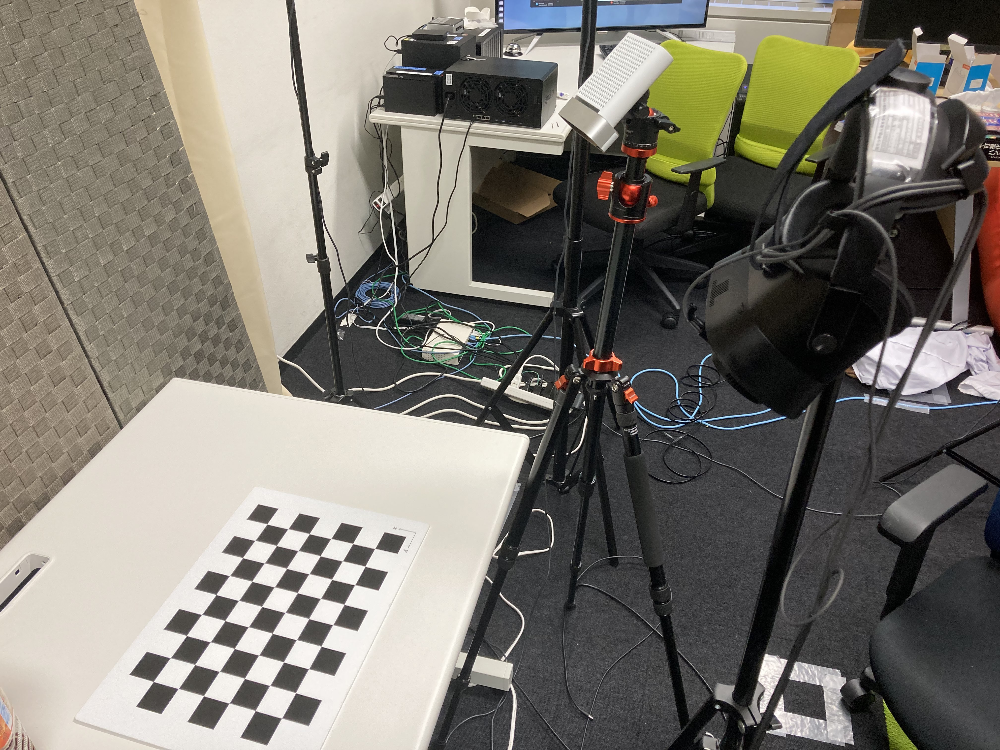

## 動作環境

Windows10

## 使用機器

- XR-1

- Azure Kinect

- Leap Motion
  
  XR-1の前面に装着
  
  

## 使用ソフト

- Unity 2020.3.8f

- Python 3.7

- Varjo Base v3.7.1.11

- Ultraleap v5.6.1

- Kinect SDK v1.4.1

## 構築手順

### 1．このリポジトリをクローン

### 2．使用ソフトをインストール

### 3．Unity環境の構築

#### ~~3.1 Kinect~~ 埋め込み済み

ここを参照

[C#で始めるAzure Kinect開発⑤：Unityでの開発セットアップ - tks_yoshinagaの日記](https://tks-yoshinaga.hatenablog.com/entry/azurekinect-5)

#### 3.2 XR-1

ここを参照

[Getting Started with Varjo XR Plugin for Unity | Varjo for developers](https://developer.varjo.com/docs/unity-xr-sdk/getting-started-with-varjo-xr-plugin-for-unity)

Runtime/XRSubsystems/VarjoCameraSubsystem.cs を以下のものに置きかえ

<details>
<summary>このプログラムをコピペ</summary>

```
using System;
using System.Collections.Generic;

using Unity.Collections;
using UnityEngine;
using UnityEngine.XR.ARSubsystems;

using XRCpuImageHandle = System.Int32;

namespace Varjo.XR
{
    /// <summary>
    /// Varjo implementation of the <c>VarjoCameraSubsystem</c>. Do not create this directly.
    /// Use <c>VarjoCameraSubsystemSubsystemDescriptor.Create()</c> instead.
    /// See <see cref="UnityEngine.XR.ARSubsystems.XRCameraSubsystemDescriptor">XRCameraSubsystemDescriptor</see>.
    /// </summary>
    public sealed partial class VarjoCameraSubsystem : XRCameraSubsystem
    {
        #region NestedTypes
        private class VarjoCpuImage : IDisposable
        {
            public readonly NativeArray<byte> leftBuffer, rightBuffer;
            public readonly VarjoBufferMetadata leftBufferMetadata, rightBufferMetadata;

            public bool IsDisposed { get; private set; }

            public void Dispose()
            {
                if (IsDisposed) return;

                IsDisposed = true;
                leftBuffer.Dispose();
                rightBuffer.Dispose();

                GC.SuppressFinalize(this);
            }

            public NativeArray<byte> GetBuffer(VarjoStreamChannel channel) => channel == VarjoStreamChannel.Left ? leftBuffer : rightBuffer;

            public VarjoBufferMetadata GetMetadata(VarjoStreamChannel channel) => channel == VarjoStreamChannel.Left ? leftBufferMetadata : rightBufferMetadata;

            public static VarjoCpuImage CreateImage(out DistortedColorFrameMetadata frameMetadata, VarjoDistortedColorStreamInternal sourceStream, Allocator allocator)
            {
                NativeArray<byte> leftBuffer, rightBuffer;
                VarjoBufferMetadata leftBufferMetadata, rightBufferMetadata;

                sourceStream.ObtainCPUDataCopy(allocator, out leftBuffer, out rightBuffer, out leftBufferMetadata, out rightBufferMetadata, out frameMetadata);

                return new VarjoCpuImage(leftBuffer, rightBuffer, leftBufferMetadata, rightBufferMetadata);
            }

            private VarjoCpuImage(NativeArray<byte> leftBuffer, NativeArray<byte> rightBuffer, VarjoBufferMetadata leftBufferMetadata, VarjoBufferMetadata rightBufferMetadata)
            {
                IsDisposed = false;
                this.leftBuffer = leftBuffer;
                this.rightBuffer = rightBuffer;
                this.leftBufferMetadata = leftBufferMetadata;
                this.rightBufferMetadata = rightBufferMetadata;
            }
            ~VarjoCpuImage()
            {
                if (!IsDisposed)
                    Dispose();
            }
        }


        private static class CPUImages
        {
            private static readonly Dictionary<XRCpuImageHandle, VarjoCpuImage> allocatedCPUImages = new Dictionary<int, VarjoCpuImage>();
            private static XRCpuImageHandle nextHandle = 1;

            public static int Count => allocatedCPUImages.Count;

            public static VarjoCpuImage GetImage(XRCpuImageHandle handle)
            {
                if (allocatedCPUImages.TryGetValue(handle, out var result))
                {
                    return result;
                }
                else
                    return null;
            }
            public static XRCpuImageHandle AddImage(VarjoCpuImage cpuImage)
            {
                allocatedCPUImages.Add(nextHandle, cpuImage);
                return nextHandle++;
            }
            public static bool RemoveImage(XRCpuImageHandle handle)
            {
                return allocatedCPUImages.Remove(handle);
            }
            public static void RemoveAllImages()
            {
                allocatedCPUImages.Clear();
            }
            public static bool HasImage(XRCpuImageHandle handle)
            {
                return allocatedCPUImages.ContainsKey(handle);
            }
            public static void DisposeAllImages()
            {
                if (Count != 0)
                {
                    foreach (var image in Enumerate())
                    {
                        image.Value.Dispose();
                    }
                    RemoveAllImages();
                }
            }

            public static IEnumerable<KeyValuePair<XRCpuImageHandle, VarjoCpuImage>> Enumerate() => allocatedCPUImages;
        }


        /// <summary>
        /// Interface for providing Varjo camera functionality for the VarjoXRCameraSubsystem.
        /// </summary>
        private sealed class VarjoCameraProvider : Provider
        {
            public override void Start()
            {
                base.Start();

                if (!VarjoMixedReality.StartRender())
                {
                    Debug.Log("Can't start Mixed Reality.");
                    Stop();
                }
            }
            public override void Stop()
            {
                base.Stop();
                colorStream.Stop();
                metadataStream.Stop();
                VarjoMixedReality.StopRender();

                if (CPUImages.Count != 0)
                {
                    CPUImages.DisposeAllImages();
                }
            }

            public override bool permissionGranted => true;

            public override Feature currentCamera => Feature.WorldFacingCamera;

            public override XRCpuImage.Api cpuImageApi => cpuImageAPIInstance;

            public override bool TryAcquireLatestCpuImage(out XRCpuImage.Cinfo cameraImageCinfo)
            {
                if (!colorStream.IsReadyToReturnImage())
                {
                    cameraImageCinfo = default;
                    return false;
                }

                ref readonly VarjoStreamConfig config = ref colorStream.ConfigRef;

                var img = VarjoCpuImage.CreateImage(out var streamMetadata, colorStream, ImagesAllocator);
                XRCpuImageHandle handle = CPUImages.AddImage(img);

                double timestamp = streamMetadata.timestamp / 1.0E+9d;  //nanoseconds to seconds

                cameraImageCinfo = new XRCpuImage.Cinfo(
                    nativeHandle: handle,
                    dimensions: new Vector2Int(config.width, config.height),
                    planeCount: 2,
                    timestamp,   //Unity take value in seconds
                    format: GetCompatibleFormat(in img.leftBufferMetadata));
                return true;
            }

            //TODO: implement TryGetFrame
            //TODO: implement GetTextureDescriptors

            public override bool autoFocusEnabled => false; //Currently we supporting only fixed focus

            public override Feature currentLightEstimation => Feature.None; //Currently not supported

            public override bool TryGetIntrinsics(out XRCameraIntrinsics cameraIntrinsics)
            {
                if (colorStream.IsReadyToReturnImage())
                {
                    ref readonly var config = ref colorStream.ConfigRef;
                    var intrinsics = colorStream.GetCameraIntrinsics(Channel);

                    cameraIntrinsics = new XRCameraIntrinsics(
                        focalLength: new Vector2((float)intrinsics.focalLengthX, (float)intrinsics.focalLengthY),
                        principalPoint: new Vector2((float)intrinsics.principalPointX, 1.0f - (float)intrinsics.principalPointY),
                        resolution: new Vector2Int(config.width, config.height));

                    return true;
                }
                else
                {
                    cameraIntrinsics = default;
                    return false;
                }
            }

            public override XRCameraConfiguration? currentConfiguration
            {
                get
                {
                    if (!colorStream.IsStarted())
                    {
                        return null;
                    }
                    ref readonly var config = ref colorStream.ConfigRef;
                    return new XRCameraConfiguration(handle: IntPtr.Zero, resolution: new Vector2Int(config.width, config.height), framerate: config.frameRate);
                }
            }
            public override NativeArray<XRCameraConfiguration> GetConfigurations(XRCameraConfiguration defaultCameraConfiguration, Allocator allocator)
            {
                XRCameraConfiguration? config = currentConfiguration;
                if (config != null)
                {
                    var array = new NativeArray<XRCameraConfiguration>(1, allocator);
                    array[0] = currentConfiguration.Value;
                    return array;
                }
                else
                {
                    return new NativeArray<XRCameraConfiguration>(0, allocator);
                }
            }

            //return XRCpuImage.Format that corresponds to native format of the buffer:
            private static XRCpuImage.Format GetCompatibleFormat(in VarjoBufferMetadata metadata)
            {
                if (metadata.textureFormat == VarjoTextureFormat.NV12)
                    return XRCpuImage.Format.IosYpCbCr420_8BiPlanarFullRange;
                else
                    return XRCpuImage.Format.Unknown;
            }
        }
        #endregion

        private static readonly VarjoCpuImageAPI cpuImageAPIInstance = new VarjoCpuImageAPI();
        private static readonly VarjoDistortedColorStreamInternal colorStream = new VarjoDistortedColorStreamInternal();
        private static readonly VarjoCameraMetadataStream metadataStream = new VarjoCameraMetadataStream();

        private Material undistortionMaterial;

        public const string VarjoCameraID = "Varjo Camera";


        /// <summary>
        /// Allocator using to create CPU images.
        /// </summary>
        public static Allocator ImagesAllocator { get; set; } = Allocator.Temp;

        /// <summary>
        /// Allocator using to allocate buffers for async requests.
        /// </summary>
        public static Allocator AsyncRequestAllocator { get; set; } = Allocator.Persistent;

        /// <summary>
        /// Channel to get images from.
        /// </summary>
        /// <remarks>
        /// <see cref="XRCameraSubsystem.TryAcquireLatestCpuImage(out XRCpuImage)"/> will get data for both left and right channels.
        /// </remarks>
        public static VarjoStreamChannel Channel { get; set; } = VarjoStreamChannel.Left;


        /// <summary>
        /// Is Color Stream Enabled.
        /// </summary>
        /// <value><c>true</c> if color stream is running.</value>
        public bool IsColorStreamEnabled => colorStream.IsStarted();

        /// <summary>
        /// Is Metadata stream enabled.
        /// </summary>
        public bool IsMetadataStreamEnabled => metadataStream.isActive;

        /// <summary>
        /// Metadata stream from VST cameras. This is internally the same stream as Color stream, but
        /// without camera texture buffers. Only one of the streams can be active.
        /// </summary>
        public VarjoCameraMetadataStream MetadataStream => metadataStream.isActive ? metadataStream : null;


        public VarjoCameraSubsystem() : base() { }
        ~VarjoCameraSubsystem()
        {
            if (CPUImages.Count != 0)
            {
                Debug.LogError("Cpu images were not disposed! Possible memory leak! Undisposed images count: " + CPUImages.Count.ToString());
                CPUImages.DisposeAllImages();
            }
        }

        /// <summary>
        /// Try to run color stream through camera.
        /// Note that only one of two streams (color or metadata) could be active.
        /// Use this one if you need to get images from the camera.
        /// </summary>
        /// <returns><c>true</c> if success.</returns>
        public bool EnableColorStream()
        {
            if (!running || IsColorStreamEnabled || IsMetadataStreamEnabled) return false;

            colorStream.Start();
            return VarjoError.CheckError();
        }

        /// <summary>
        /// Disable color stream.
        /// </summary>
        public void DisableColorStream()
        {
            if (!running || !IsColorStreamEnabled) return;

            colorStream.Stop();
        }

        /// <summary>
        /// Try run the metadata stream.
        /// Note that only one of two streams (color or metadata) could be active.
        /// Use this one if you only need the metadata to match lighting and white balance of the virtual content with the VST camera image.
        /// </summary>
        /// <returns></returns>
        public bool EnableMetadataStream()
        {
            if (!running || IsColorStreamEnabled || IsMetadataStreamEnabled) return false;
            return metadataStream.Start();
        }

        /// <summary>
        /// Disable metadata stream.
        /// </summary>
        public void DisableMetadataStream()
        {
            metadataStream.Stop();
        }

        public VarjoTextureFormat? GetNativeTextureFormatOfCPUImage(XRCpuImageHandle handle)
        {
            VarjoCpuImage image = CPUImages.GetImage(handle);

            string errorMessage = null;

            if (image == null)
                errorMessage = $"Cand find image with handle \"{handle}\"";
            else if (image.IsDisposed)
                errorMessage = $"Image with handle \"{handle}\" is already disposed!";

            if (errorMessage != null)
            {
                VarjoError.HandleErrorMessage(errorMessage);
                return null;
            }

            return image.GetMetadata(Channel).textureFormat;
        }

        public bool GetRawCPUImageData(XRCpuImageHandle handle, out NativeArray<byte> array, out Vector2 size)
        {
            VarjoCpuImage image = CPUImages.GetImage(handle);

            string errorMessage = null;

            if (image == null)
                errorMessage = $"Cand find image with handle \"{handle}\"";
            else if (image.IsDisposed)
                errorMessage = $"Image with handle \"{handle}\" is already disposed!";

            if (errorMessage != null)
            {
                VarjoError.HandleErrorMessage(errorMessage);
                array = default;
                size = default;
                return false;
            }

            var metadata = image.GetMetadata(Channel);
            size = new Vector2(metadata.width, metadata.height);

            array = image.GetBuffer(Channel);

            return true;
        }

        public bool TryGetDistortionCoefficients(out VarjoDistortionCoefficients distortionCoefficients)
        {
            if (colorStream.IsReadyToReturnImage())
            {
                var intrinsics = colorStream.GetCameraIntrinsics(Channel);

                distortionCoefficients = new VarjoDistortionCoefficients(
                    K: new Vector4((float)intrinsics.distortionCoefficients[0], (float)intrinsics.distortionCoefficients[1], (float)intrinsics.distortionCoefficients[2], (float)intrinsics.distortionCoefficients[3]),
                    Kr: Vector2.zero,
                    P: new Vector2((float)intrinsics.distortionCoefficients[4], (float)intrinsics.distortionCoefficients[5]));

                return true;
            }
            else
            {
                distortionCoefficients = default;
                return false;
            }
        }

        public bool TryGetRectificationMatrix(out Matrix4x4 rectificationMatrix)
        {
            if (colorStream.IsReadyToReturnImage())
            {
                VarjoMatrix extrinsics = colorStream.GetCameraExtrinsics(Channel);
                rectificationMatrix = VarjoMathUtils.GetRectificationMatrix(extrinsics);

                return true;
            }
            else
            {
                rectificationMatrix = default;
                return false;
            }
        }

        public VarjoStreamConfig GetColorStreamConfig()
        {
            if (colorStream.IsReadyToReturnImage())
            {
                return colorStream.ConfigRef;
            }

            return new VarjoStreamConfig();
        }
        
        public bool TryGetExtrinsics(out VarjoMatrix extrinsics)
        {
            if (colorStream.IsReadyToReturnImage())
            {
                extrinsics = colorStream.GetCameraExtrinsics(Channel);

                return true;
            }
            else
            {
                extrinsics = default;
                return false;
            }
        }

        public bool TryUndistortImage(Texture2D sourceTexture, ref RenderTexture targetTexture)
        {
            XRCameraIntrinsics intrinsics;
            VarjoDistortionCoefficients distortionCoefficients;
            Matrix4x4 rectificationMatrix;
            Camera camera = Camera.main;

            if (!TryGetIntrinsics(out intrinsics) || !TryGetRectificationMatrix(out rectificationMatrix) || !TryGetDistortionCoefficients(out distortionCoefficients) || camera == null) return false;

            if (undistortionMaterial == null) undistortionMaterial = new Material(Shader.Find("Varjo/Undistort"));

            if (targetTexture == null
                || targetTexture.width != sourceTexture.width
                || targetTexture.height != sourceTexture.height
                || targetTexture.graphicsFormat != sourceTexture.graphicsFormat)
            {
                targetTexture =
                    new RenderTexture(sourceTexture.width, sourceTexture.height, 0, sourceTexture.graphicsFormat);
                targetTexture.name = Channel == VarjoStreamChannel.Left ? "Left undistorted camera image" : "Right undistorted camera image";
            }

            undistortionMaterial.SetMatrix("_InvProjectionMatrix", camera.GetStereoProjectionMatrix((Camera.StereoscopicEye)Channel).inverse);
            undistortionMaterial.SetMatrix("_InvRectificationMatrix", rectificationMatrix.inverse);

            undistortionMaterial.SetVector("_K", distortionCoefficients.K);
            undistortionMaterial.SetVector("_Kr", distortionCoefficients.Kr);
            undistortionMaterial.SetVector("_P", distortionCoefficients.P);
            undistortionMaterial.SetVector("_F", intrinsics.focalLength);
            undistortionMaterial.SetVector("_C", intrinsics.principalPoint);
            undistortionMaterial.SetFloat("_AspectRatio", intrinsics.resolution.x / intrinsics.resolution.y);
            Graphics.Blit(sourceTexture, targetTexture, undistortionMaterial);
            return true;
        }

        [RuntimeInitializeOnLoadMethod(RuntimeInitializeLoadType.SubsystemRegistration)]
        static void RegisterDescriptor()
        {
            XRCameraSubsystem.Register(new XRCameraSubsystemCinfo()
            {
                id = VarjoCameraID,
                providerType = typeof(VarjoCameraProvider),
                subsystemTypeOverride = typeof(VarjoCameraSubsystem),
                supportsCameraConfigurations = true,
                supportsCameraImage = true,
                supportsTimestamp = true
            });
        }
    }
}
  
```
</details>

#### 3.3 LeapMotion

ここを参照

[Ultraleap Plugin for Unity](https://developer.leapmotion.com/unity)

#### ~~3.4 Python~~ 埋め込み済み

Windows PowerShellで以下のコマンドを実行

```shell
git clone https://github.com/pythonnet/pythonnet.git  
cd pythonnet\pythonnet\runtime\Python.Runtime.dll  
dotnet build -c ReleaseWinPY3 -f netstandard2.0 Python.Runtime.csproj
```


後，以下の位置に配置 (dotnet等は適宜インストール)

`RemoveObjects\Assets\Plugins\Python.Runtime.dll`

## 実行手順

1. 机を見下ろすような形でKinectを設置
   
   

2. Varjo Base と Ultraleap を起動

3. Unity を起動

4. キャリブレーション
   
   XR-1とKinectから見える位置にチェスボードを置きスペースキーを押す

5. 背景モデル生成
   
   チェスボードをどかして１を押す

6. 物体を置くと一定時間後に物体モデルが生成

## 使い方
・物体を置くと，設置されたことが検知され物体モデルが生成される

・物体モデルに触れると，見た目を制御するためのメニューが表示される

・ボタンを押す際，ボタンが紫色に変化した状態になると押された判定になる

・ボタンを押すと表示が切り替わる

・透明度変更はスライダを左右に移動させると表示が切り替わる

・メニュー右上の赤いボタンを押すとメニューが閉じる

・別の物体を選択する際は，一度赤いボタンを押してメニューを閉じる必要がある

### 注意点
・手を動かさないでおくと，手の３Dモデルが生成されてしまいます

## トラブルシューティング
### キャリブレーションがうまくいかない
KinectとHMD両方からチェスボードが見えるようにしてください

### 位置ずれがひどい
もう一度キャリブレーションをし直してください

### HMDが認識されない
原因不明です．HMDを再起動するなどしてください

## 階層構造
```
RemoveObject/Assets
  ├─Materials       ：マテリアルまとめ
  │   
  ├─Plugins         ：Plugin まとめ
  │ 
  ├─Resources       ：物体モデルの元となる Prefab まとめ
  │ 
  ├─Scenes          ：Unity シーン
  │ 
  ├─Scripts         ：
  │  ├─Calibration  ：カメラキャリブレーション処理
  │  ├─Kinect       ：Kinect 周りの処理
  │  ├─Manager      ：システム全体の値を管理
  │  ├─MyUtils      ：便利系スクリプトまとめ
  │  ├─Python       ：Unity と Python の通信
  │  ├─Render       ：物体モデルの表示・見た目処理
  │  └─XRHMD        ：XR-1 周りの処理
  │ 
  └─Shaders         ：物体の見た目変更用のシェーダ
```

## モジュール構成
各モジュールの処理・関数についてはプログラム内のコメントを参照
```
RemoveObject/Assets/Scripts
  │  
  ├─Calibration
  │      CalibrationDevice.cs         ：キャリブレーションする機器の定義
  │      CameraCalibration.cs         ：キャリブレーション用プログラム
  │      
  ├─Kinect
  │      MultipleKinectScript.cs      ：Kinect のデータ処理
  │      
  ├─Manager
  │      CalibrationManager.cs        ：すべての機器のキャリブレーション結果を管理・座標変換処理を実行
  │      EffectsUIManager.cs          ：物体モデルの見た目の変更・UI 操作を管理
  │      ObjectMeshesManager.cs       ：すべての物体モデルの見た目を管理
  │      
  ├─MyUtils
  │      GenerateMeshFromScriptableObject.cs  ：ScriptableObject からメッシュを生成
  │      MeshData.cs                  ：メッシュ保存用データ構造
  │      SingletonMonoBehaviour.cs    ：継承すると MonoBehaviour からシングルトンを実装
  │      Utils.cs                     ：便利系スクリプトまとめ
  │      
  ├─Python
  │      PythonScript.cs              ：Unity と Python のプロセス通信処理
  │      
  ├─Render
  │      ChangeEffect.cs              ：物体モデルの見た目を変更
  │      GetDifference.cs             ：深度の差分取得
  │      MeshRender.cs                ：物体モデルの生成処理・物体モデルの本体
  │      
  └─XRHMD
        StartXR.cs                    ：XR のデータ処理
```
